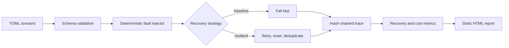

# Agent Reliability Lab

Agent Reliability Lab is a deterministic fault-injection benchmark for tool-using AI agents.
It measures whether an agent strategy can recover from timeouts, provider failures, malformed
tool output, partial streams, stale memory, and repeated calls—without requiring API keys,
network access, or a model provider.

Most agent demos show only the happy path. This repository makes failure behavior reproducible:
scenario files define the intended tool workflow and injected fault, the runner produces a
content-addressed trace, and the report compares pass rate, recovery, calls, and virtual latency.

## What it demonstrates

- Deterministic, TOML-defined fault scenarios.
- Baseline and resilient recovery strategies.
- Six built-in fault classes with bounded retry and deduplication behavior.
- Content-addressed run IDs and idempotent artifacts.
- SHA-256 hash-chained traces with tamper verification.
- Portable HTML benchmark reports with no JavaScript or web server.
- Unit, integration, and CLI end-to-end tests with an 80% coverage floor.

## Quick start

```bash
python -m venv .venv
source .venv/bin/activate
pip install -e ".[dev]"

make demo
open demo/reliability-report.html
```

[Open the generated sample report](docs/demo-report.html).

The simulator's latency and cost units are deterministic comparison signals, not production SLA
or provider-pricing claims.

## Commands

```bash
# Validate one scenario
agent-reliability-lab validate scenarios/timeout.toml

# Compare the baseline and resilient strategies across every scenario
agent-reliability-lab suite scenarios \
  --strategies baseline,resilient \
  --output benchmark

# Run one strategy and preserve its trace
agent-reliability-lab run scenarios/stale-memory.toml \
  --strategy resilient \
  --output runs

# Verify that a stored trace has not been changed
agent-reliability-lab replay runs/<run-id>/trace.jsonl

# Rebuild a report from saved runs
agent-reliability-lab compare runs --output reliability-report.html
```

## Architecture



The core simulator is intentionally provider-neutral. To benchmark a real agent, adapt its tool
events into the same trace schema or replace the deterministic step executor while preserving
scenario and reporting interfaces.

## Scenario format

```toml
[scenario]
name = "timeout"
description = "The log provider times out once"
seed = 17

[[steps]]
tool = "fetch_logs"
arguments = { service = "api" }
result = { status = "healthy" }

[[faults]]
kind = "timeout"
step = 0
occurrence = 1
repeat = 1
```

Fault occurrences are one-indexed per step. `repeat` controls consecutive injected attempts.
The resilient strategy has a two-retry budget; a fault repeated three times therefore remains a
deliberate failure case.

## Run artifacts

```text
runs/<scenario>-<strategy>-<content-hash>/
├── run.json      # outcome and metrics
└── trace.jsonl   # ordered, hash-chained events
```

Changing the scenario, seed, steps, faults, or strategy creates a new run ID. Repeating an
unchanged run returns the same directory without overwriting its trace.

## Project layout

```text
agent-reliability-lab/
├── scenarios/                    # six reproducible fault cases
├── src/agent_reliability_lab/    # simulator, traces, storage, reports, CLI
├── tests/                        # unit, integration, and CLI E2E tests
├── docs/                         # sample report and TDD evidence
├── Dockerfile
├── Makefile
└── pyproject.toml
```

## Limitations

- The included executor is a deterministic simulator, not a model-quality benchmark.
- Virtual latency and cost make strategies comparable but do not model a specific provider.
- Real-agent adapters must normalize provider traces and protect any production data they ingest.
- Passing these scenarios does not prove an agent is safe; it proves only the named recovery
  guarantees under the declared fault model.

## Responsible evaluation

The lab runs locally on synthetic scenarios. Reports explain each result with scenario, strategy,
pass/fail, faults, recoveries, tool calls, and virtual latency. Each HTML dashboard includes an
expandable evidence table and Print/PDF styling; a sibling CSV provides the same aggregate rows.
An empty run set has no strategy claim, and production promotion requires human review rather than
automatic selection from a simulated pass rate.

- [Privacy and local analysis](PRIVACY.md)
- [Evaluator training](docs/EVALUATOR_TRAINING.md)
- [Deployment runbook](docs/DEPLOYMENT_RUNBOOK.md)
- [Counterfactual and fairness checks](docs/FAIRNESS_AND_COUNTERFACTUALS.md)
- [Outcome metrics](docs/METRICS.md)

## License

MIT.
